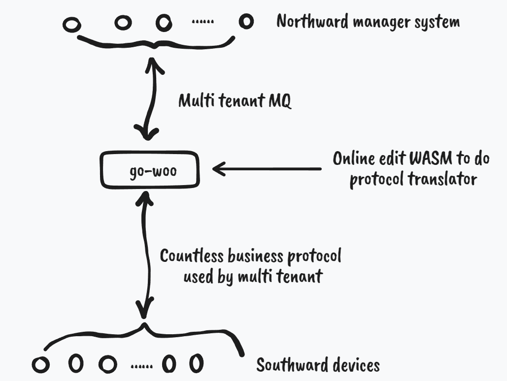

  

## What is go-woo
go-woo is a high-performance IoT business protocol translator. 
In the real world, the most difficult thing for the implementation 
of the Internet of things is the interconnection between a variety 
of devices and lots management system.
IoT has 2 types of protocol,they are physical protocol and business 
logic protocol.The physical protocols often are international standards 
and support by international org and corp.But business logic protocols
over physical protocols were developed and implemented by manufacturers.
go-woo use `WASM` script to translate between different business logic 
protocol.
For northward manager system,go-woo provide Apache Pulsar as pipeline.
go-woo provide `multi-tenant` for southward devices and northward manager
system.

## Features
- [ ] Provide http api for manager
- [ ] Provide gRpc for microservice
- [ ] Support WASM script to translate business protocol 
- [ ] Multi tenant MQTT and Apache Pulsar
- [ ] Manager data in ent and cache
- [ ] Cli manager tool
- [ ] Time-serial database

## How It Works
## How to test WASM script